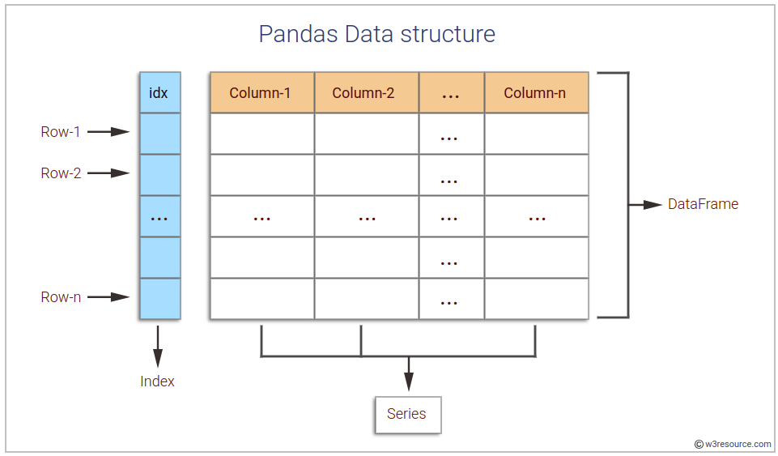
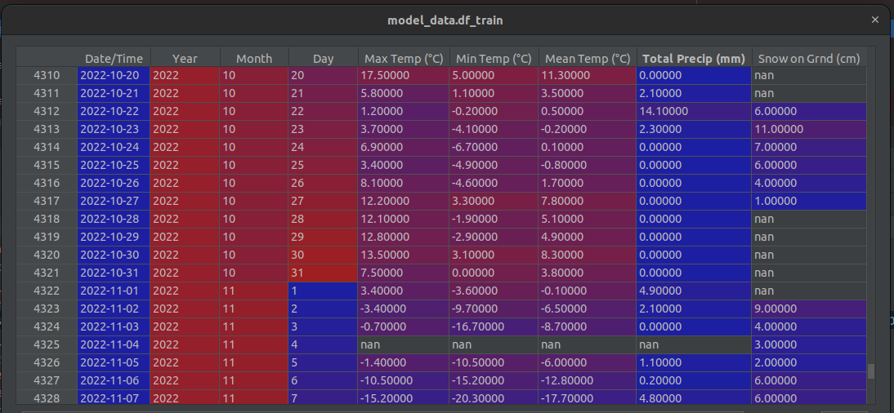
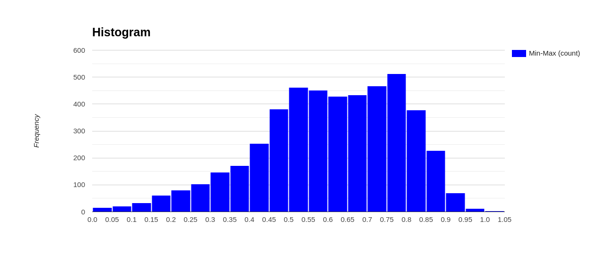
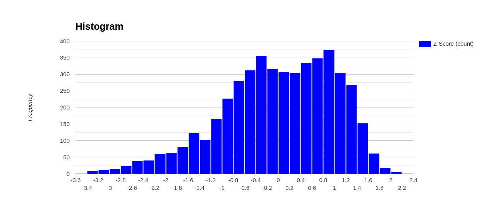
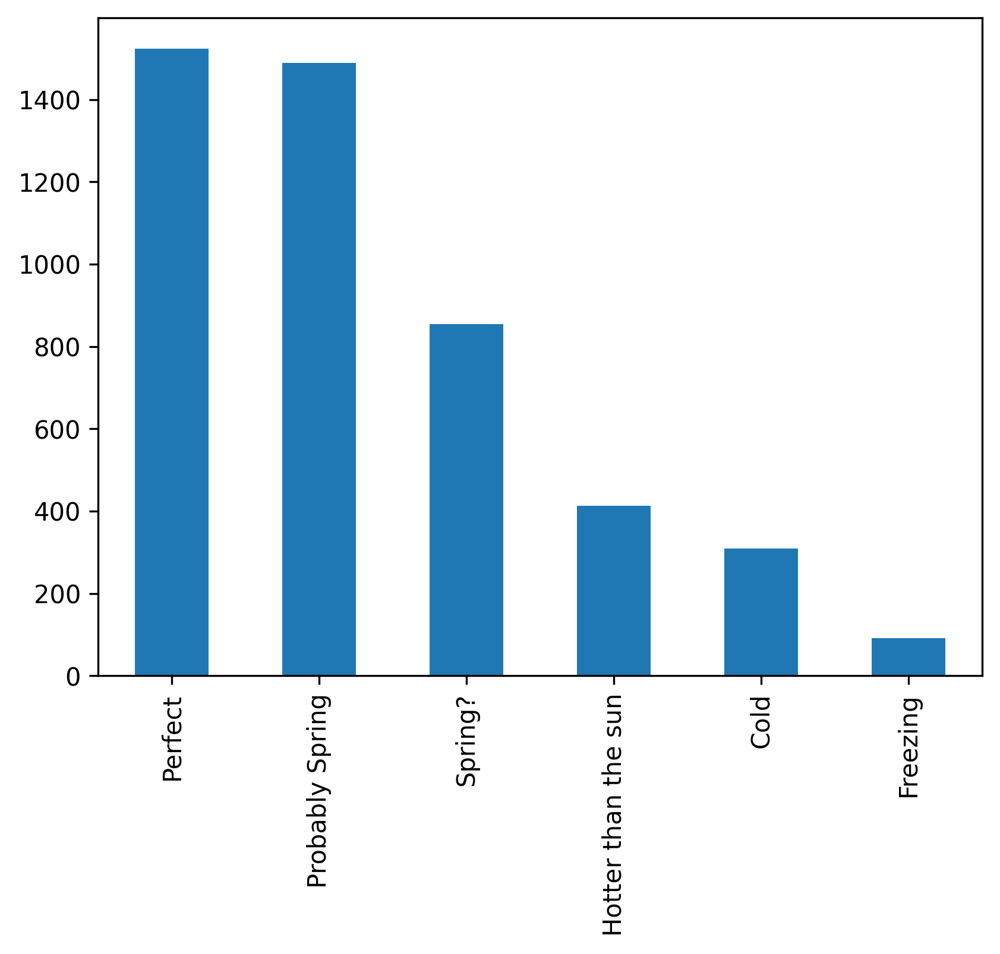

# Data Wrangling In Python
This code and readme doc was created for Session #3 of the Spe Calgary Data Science Mentorship Program, presented on the 25th of October, 2023.

This tutorial was meant to be a brief (~1 hour introduction) to using the [Pandas python package](https://pandas.pydata.org/) for data science and data analytics.

## Summary
* [What is Pandas?](#what-is-pandas)
* [Processing Data](#processing-data)
* [Data Cleaning](#data-cleaning)
* [Data Normalization](#data-normalization)
* [Binning](#binning)
* [Resources](#resources)
* [Video Tutorials](#video-tutorials)

## What is Pandas?
Pandas is a python library that makes our lives as data scientists much easier. It's an excellent way to import large datasets into your code in order to work with, manipulate and interpret the sets.

Pandas is effective at manipulating large datasets easily and effectively by using something called dataframes. A dataframe is essentially a table that contains rows and columns and other metadata that pandas uses to make your life easier.



## Processing Data
This involves loading the data from some table-like data into a dataframe. Some of the common sources of data to read for Pandas with the related pandas function in brackets are:
* csv (read_csv)
* excel (read_excel)
* sql (read_sql)
* json (read_json)
* hdf (read_hdf)

and many more sources [that can be found here](https://pandas.pydata.org/docs/reference/io.html).

Most of these input/output methods follow a similar pattern where the user supplies a source to read and then various options for the source, eg. in this code
```python
self.df_test = pd.read_csv(self.load_general_path.format(year), usecols=col_list, nrows=nrows)
```
Where the path to a csv file is supplied as the first argument and then the options `usecols` and `nrows`. The option `usecols` takes a list of the columns that you would like to import, making the memory usage of the dataframe smaller as not all of the columns are imported. Similarly, `nrows` only imports the number of rows that are defined by the integer given to this option, you can also use `skiprows` to start further down the data table if you would like. This makes loading and more importantly memory more efficient by only loading the rows you need.

A note to remember when using `read_excel` is that sometimes excel workbooks have separate sheets and you may want to import a specific sheet (other than the first one). To do so, the following option can be used:
```python
df_dict = pd.read_excel(excel_filepath, sheet_name=None)

# Check all sheet names
df_dict.keys()

# Access the individual sheets by their name
df_dict.get('Canada')
```
Also, you can specify the sheet names directly with a string using the `sheet_name` option to only load that sheet.
## Data Cleaning
Data isn't perfect. Sometimes there is missing or non-sensical data that can wreak havoc on your calculations. The most common and the one we'll talk about here the most is nan values in the dataframe.


As you can see from our example here, there are many values that are undefined (ie. nan) inside the dataframe. These undefined values make calculations with the dataframe can lead to errors and just weird behavior for data science projects. 

There are a few different built-in methods to handle these nan values in pandas. 
### fillna()
The `fillna()` method takes in a value that it will replace all of the nan values with, eg:
```python
df.fillna(0.0, inplace=True)
```
Where are all of the nan values are replaced with 0. This can be problematic if, for example with weather, you end up with a 0 degree day in August. 

Please note the `inplace` option, this is a commonly used option in pandas and increases the efficiency from a memory perspective as you do not need to copy the entire dataframe. Python is kind of poor at managing memory and when you're working with large datasets it becomes essential to make sure that you're programming in a way that limits pointless memory use.

### Forward fill and Backward fill method
These two methods are methods within the `fillna()` methods and are used with the following options
```python
# Forward fill
df.fillna(method="ffill", inplace=True)

#Backward fill
df.fillna(method="bfill", inplace=True)
```
These methods replace the nan values in columns with either the n-1 or n+1 value for forward fill and backward fill respectively, working from index 0 (forward fill) or index N (backward fill). These methods are helpful if you have reasonably consistent data from row to row or time dependent data.

### dropna()

Another option is `dropna()`, which simply removes the dataframe rows with nan data. This works well when you have a very large amount of data points with relatively few nan values.
```python
df.dropna(inplace=True)
```

## Data Normalization
For data science and machine learning, most of the time it is very important to normalize your data values. For example, if you're trying to train a model with both permeability and cumulative production values, the production values have a much larger magnitude and thus mathematically would probably drown out the impact permeability would have on your model.

### Min-Max Scaling
Min-max scaling is one of the more common methods to normalize data for data science as it gives you a range of 0 to 1 (or sometimes -1 to +1) and will equalize different variables to the same value range.


Where the min-max normalization is calculated in pandas in the following example
```python
# use the min-max scaling
self.df_train['minmax scaled Max Temp (°C)'] = (self.df_train['Max Temp (°C)'] - self.df_train['Max Temp (°C)'].min()) / (self.df_train['Max Temp (°C)'].max() - self.df_train['Max Temp (°C)'].min())
```
Where we subtract the minimum value from all of the values in the data series and divide by the range. Note that here I am adding a new column to the dataframe to store the min-max normalized values.
### Z-score method
Another good alternative to min-max is z-score, where you subtract the mean from each value and divide by the standard deviation. This leaves your feature distributions with a mean = 0 and a standard deviation = 1, you end up with a distribution like the image below


The calculation in pandas looks like the one done below
```python
self.df_train['zscaled Max Temp (°C)'] = (self.df_train['Max Temp (°C)'] - self.df_train['Max Temp (°C)'].mean()) / self.df_train['Max Temp (°C)'].std()
```
Suppose you're not sure whether the outliers truly are extreme. In this case, start with z-score unless you have feature values that you don't want the model to learn; for example, the values are the result of measurement error or a quirk.

## Binning
Data binning (or bucketing) groups data in bins (or buckets), in the sense that it replaces values contained into a small interval with a single representative value for that interval. Sometimes binning improves accuracy in predictive models.

Binning can be applied to convert numeric values to categorical or to sample (quantise) numeric values.

* convert numeric to categorical includes binning by distance and binning by frequency
* reduce numeric values includes quantisation (or sampling).

Binning is a technique for data smoothing. Data smoothing is employed to remove noise from data. Three techniques for data smoothing:

* binning
* regression
* outlier analysis

We will go through a categorical binning using the `pd.cut()` method, which will convert the max temperatures into 6 different categories



## Resources
* [Data Analysis with Python Course](https://www.coursera.org/learn/data-analysis-with-python#syllabus)
* [Pandas Online Tutorial](https://github.com/chongjason914/pandas-tutorial)
* [Pandas Examples](https://towardsdatascience.com/30-examples-to-master-pandas-f8a2da751fa4)
* [Pandas Official documentation](https://pandas.pydata.org/pandas-docs/stable/tutorials.html)
* [Tutorials points](https://www.tutorialspoint.com/python_pandas)
* [Datacamp](https://www.datacamp.com/courses/pandas-foundations) 

## Video Tutorials
* [learn python in 1 hour](https://www.youtube.com/watch?v=kqtD5dpn9C8)
* [pycharm tutorial](https://www.youtube.com/watch?v=56bPIGf4us0)
* [Learn Python, Full Course for Beginners](https://www.youtube.com/watch?v=rfscVS0vtbw)